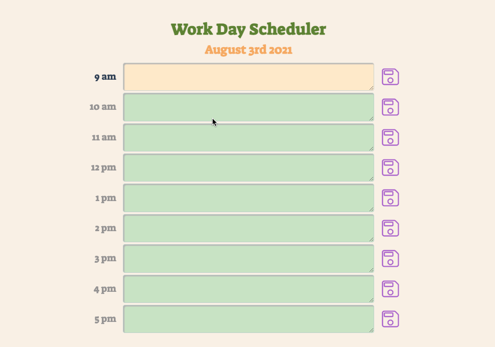

# automatic-doodle

Assignment: Work Day Scheduler

Developer: Mehdi Mehrabani

App Link: [Work Day Scheduler](https://mmehr1988.github.io/automatic-doodle/)

For this week, we were tasked with building a Work Day Scheduler that allows a user to save personal notes for each hour of the day. The main purpose of this assignment was to become familiar with third-party API’s and more specifically the Moment.js library.

Since the emphasis of this assignments was to learn a date and time library, the first thing I decided to do before attempting to write the code was to research why dates and times are so crucial for coding purposes.

Interestingly enough, this research brought back some memories of the year 2000. At the time, I never really understood what the Y2K problem was. It seemed like every adult around was talking about it, but now it all makes sense.

Prior to the year 2000, when writing code, only the last 2 digits of the year were used to distinguish one year from the next. For example, 1998 and 1999 were written as 98 and 99 respectively. Since we were entering the year 2000, if the year representation was not changed to 4 digits, computers would not be able distinguish the difference between the year 2000 and 1900.

To understand the severity of this issue, see below summary of an article written on June 21, 1999.

> " Consider the new credit cards you might be carrying--many of which already have expiration dates in the next century. When you try to buy something, the credit card terminal has to determine whether or not the card has expired. To do so, it runs a program that checks whether the expiration date is greater than the current date. If the card expires in 2003, then obviously the answer should be yes. But if the system uses only two digits to represent the year, it will find that 03 is not greater than 99, and that your card has already expired."

As a side note, I could have found a more recent example, but an article from 1999 seemed like the right thing here for nostalgic purposes.

If you want to read the full article check out this link [What are the main problems with the Y2K computer crisis and how are people trying to solve them?](https://www.scientificamerican.com/article/what-are-the-main-problem/)

## ASSIGNMENT SUMMARY

The requirements for completing the App assignment were the following.

1. Use a date utility library to work with date and time [Moment.js].

2. When you open the Work Day Scheduler:

   a. Current day is displayed at the top of the calendar

   b. Timeblocks are color coordinated based on past, present, or future.

3. Main Functionality

   a. User has the ability to enter an event in each time block

   b. User has the ability to save each event

   c. When user refreshes page, the saved events are not lost.

## Process of Writing Code

Please note, I could have used jQuery to format my CSS, but I decided it was good practice to understand flexbox in more detail. I’m sure I’ll have to use jQuery further down.

### File Structure

1. File: Index.html
2. File: README.md
3. Folder: Assets

   a. Folder: css

   - style.css

   b. Folder: js

   - script.js

4. Folder: Vendors

   a. Folder: css

   - normalize.css

### Writing Code

[A] HTML Structure

1. Header

a. `<header>`

- `<h1>`: For the main header called “Work Day Scheduler”

- `<h2>`: When user opens the scheduler, javascript uses moment.js library to change the `.innerHTML` to current date.

2. Main Body Section

- The main body is separated into 9 parts each representing 1 hour block for a typical 9hr workday.

a. `<main>`

b. `<article>`

i. `<section>` & `<label>` - The label element was used to hold the caption for each hour block
ii. `<section>` & `<textarea>` - The textarea element was used to allow user to input text
iii. `<section>` & `<button>` - The button element was used for the saving of input text in local storage

[B] Javascript Structure

1. Moment.js Variables:

- timeCurrent – used moment.js to pull the current time of the day and to format it to show only the hour number. Important to note that the hours are based on 24hr format.

- dateToday – used moment.js to pull the current date and to format it using `MMMM Do YYYY`

2. Javascript Section: Header Date

- Upon user loading the scheduler, javascript will update the `<h2>` element in the html file to show the current date

3. Javascript Section: Loop To Change Text Area Background

- For Loop - To automatically change the background color of the `<textarea>` I created a for loop.

- `var workDayHours = 9` - Total number of hours within a workday is assumed to be 9. Therefore, the length of the loop is based on this variable.

- If Statements – If statements were used to distinguish the background colors based on the `timeCurrent` variable which was formatted to show only the hour.

4. Javascript Section: Loop To Save To Local Storage

- `var btnSave` - Since `var btnSave` is targeting all the save buttons in the html, if you `console.log(btnSave)` you will notice an array / nodelist will appear showing the length to = 9. To target for example the first save button which represents the 9hr time block, all you have to do is target the `btnSave[1]`.

- addEventListener + Click Event – Knowing the above, I created a for loop with a click event listener to save the `textarea[i].value` whenever `btnSave[i]` is clicked.

5. Javascript Section: Loop To Load from Local Storage

- As done with the save to local storage for loop, I implemented the same for loading saved notes from local storage upon user refreshing the page.

# GIF Of Final Assignment

